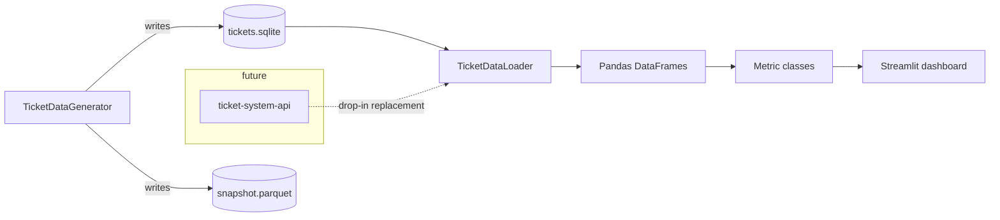

# Support Ticket Analytics

[](https://github.com/MSeyyidDev/support-ticket-analytics/actions/workflows/ci.yml)
[](https://www.python.org/downloads/)
[](LICENSE)

A polished Streamlit dashboard that turns raw IT-support ticket data into
operational insights. It ships with a self-contained synthetic dataset
(150 users, 5,000 tickets, 25,000 comments across 18 months) so you can
clone the repo, run two commands, and see the dashboard live.

The data layer is **schema-compatible with a typical `ticket-system-api`
backend**, so the synthetic loader can later be swapped for an HTTP client
without touching the analytics or dashboard code.

**Demo-ready:** deploy this repository on Streamlit Community Cloud with
`dashboard/app.py` as the entry point. If `data/tickets.sqlite` is missing, the
app now generates the synthetic demo dataset automatically on first start.

---

## Why this exists

Support teams sit on a goldmine of operational data and rarely have the
tooling to ask the right questions. This project demonstrates how a small,
well-structured Python application can turn that data into:

- Volume forecasting and seasonality detection
- SLA accountability per priority and category
- Per-agent workload balancing and throughput visibility
- Backlog trend detection (are we out-pacing our resolution rate?)
- Tag co-occurrence to surface recurring root-causes

---

## Screenshots

> Screenshots live in [`docs/screenshots/`](docs/screenshots/) — drop your
> own captures there once you have the dashboard running.

| Page          | Path                                     |
| ------------- | ---------------------------------------- |
| Overview      | `docs/screenshots/overview.png`          |
| Volume        | `docs/screenshots/volume.png`            |
| Performance   | `docs/screenshots/performance.png`       |
| SLA           | `docs/screenshots/sla.png`               |
| Agents        | `docs/screenshots/agents.png`            |
| Categories    | `docs/screenshots/categories.png`        |

---

## Data flow



The generator produces realistic seasonality:

- **Monday morning surge** between 08:00 and 11:00
- **Weekend dip** (~25% of weekday volume)
- **Patch-Tuesday aftermath** spike (Wednesday/Thursday after the second
  Tuesday of every month) reflecting Windows-update fallout
- Priority-aware resolution-time distributions and SLA targets
  (`critical=4h`, `high=8h`, `medium=24h`, `low=72h`)

---

## Insights surfaced

- **Overview** — total / open / avg-resolution / SLA-breach KPIs +
  daily volume with a 7-day rolling average.
- **Volume** — tickets per day, day-of-week × hour-of-day heatmap, monthly
  comparison.
- **Performance** — resolution time by priority, category, and agent (boxplots
  + medians); first-response-time percentiles.
- **SLA** — breach rate by priority, breach trend over time, top breach
  categories with statistical-mass filter.
- **Agents** — open tickets per agent (workload), throughput, per-agent
  resolution-time distribution.
- **Categories & Tags** — top categories, tag co-occurrence pairs, and a
  category × priority treemap.

---

## Project layout

```
support-ticket-analytics/
├── analytics/                # one metric class per file
│   ├── base.py
│   ├── tickets_per_day.py
│   ├── resolution_time.py
│   ├── priority_distribution.py
│   ├── category_frequency.py
│   ├── sla_breach.py
│   ├── open_by_agent.py
│   ├── backlog_trend.py
│   └── first_response_time.py
├── dashboard/
│   ├── app.py                # multipage Streamlit entry point
│   └── state.py              # cached loading + sidebar filters
├── data/
│   ├── generator.py          # TicketDataGenerator
│   ├── loader.py             # TicketDataLoader (drop-in for an API client)
│   └── schema.py             # SQLAlchemy models
├── tests/                    # pytest, deterministic fixtures
├── docs/screenshots/
├── Makefile
├── pyproject.toml
├── requirements.txt
└── README.md
```

---

## Schema

Three tables, normalised, ready to be replaced by a real backend.

| Table      | Key columns                                                                                                                                                       |
| ---------- | ------------------------------------------------------------------------------------------------------------------------------------------------------------------ |
| `users`    | `id`, `name`, `email`, `role` (`agent` / `requester`), `department`, `created_at`                                                                                  |
| `tickets`  | `id`, `subject`, `description`, `status`, `priority`, `category`, `tags`, `requester_id`, `agent_id`, `created_at`, `first_response_at`, `resolved_at`, `sla_target_hours` |
| `comments` | `id`, `ticket_id`, `author_id`, `body`, `created_at`                                                                                                              |

Derived columns added at load time: `resolution_hours`,
`first_response_minutes`, `sla_breached`, `is_open`.

---

## Setup

Requires Python **3.11+** and a POSIX-ish shell (or `make` on Windows via MSYS).

```bash
make install        # creates .venv and installs pinned requirements
make generate       # builds data/tickets.sqlite + data/snapshot.parquet
make test           # runs pytest
make run            # starts Streamlit on http://localhost:8501
```

Or without `make`:

```bash
python -m venv .venv
source .venv/bin/activate         # Windows: .venv\Scripts\activate
pip install -r requirements.txt
python -m data.generator
pytest
streamlit run dashboard/app.py
```

---

## Wiring it to a real backend

Replace the body of `TicketDataLoader.load()` so it returns
`TicketDataset(tickets=..., users=..., comments=...)` from your HTTP
client. The metric classes never touch SQLAlchemy directly, so nothing
else has to change.

---

## License

MIT — see [`LICENSE`](LICENSE).
